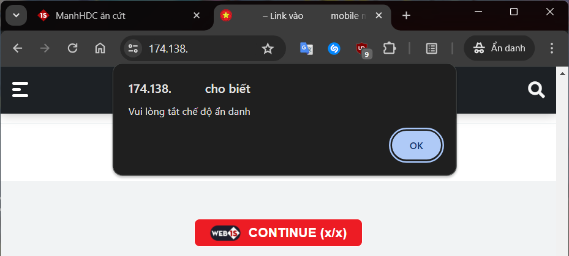
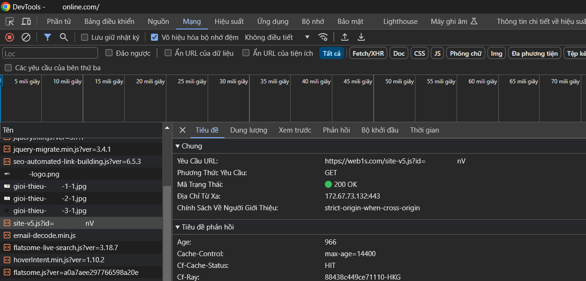
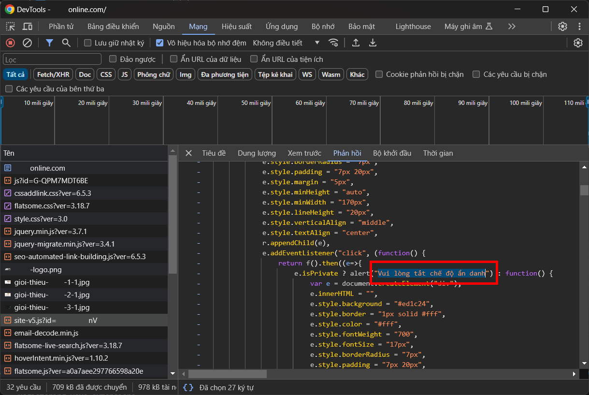
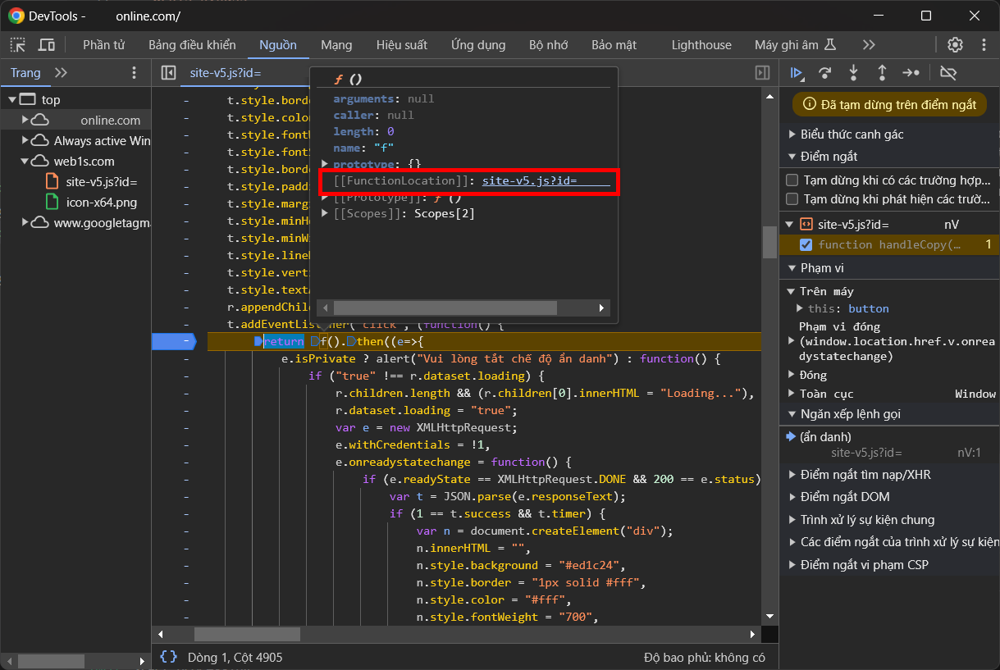
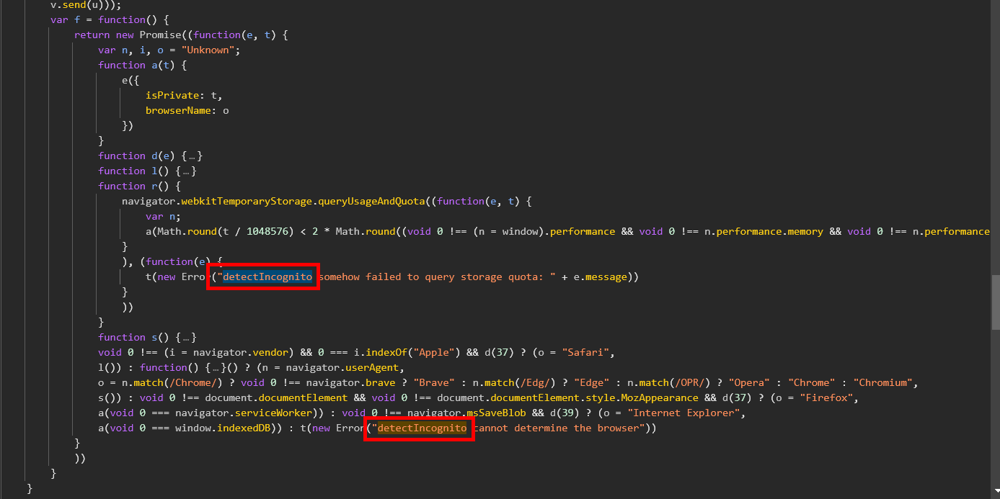

# Mở đầu
[Web1s](https://web1s.com/) là giải pháp kiếm tiền online bằng cách rút gọn liên kết, ghi chú và upload file được nhiều người sử dụng, trong đó có cả mình. [Web1s](https://web1s.com/) hoạt động chủ yếu bằng cách yêu cầu người truy cập tìm kiếm từ khóa và vào trang web cụ thể để lấy mã (hay còn gọi là vượt link rút gọn). Lợi dụng cách hoạt động của [Web1s](https://web1s.com/), nhiều người sử dụng nó để quảng cáo các web cờ bạc, cá độ bất hợp pháp. Đương nhiên không ai trong chúng ta muốn để lại những trang web này trong lịch sử tìm kiếm và lịch sử duyệt web của mình. Tuy nhiên, nếu bạn sử dụng chế độ ẩn danh để vượt link, bạn sẽ gặp phải thông báo như sau:



Trong bài viết này, chúng ta sẽ tìm hiểu cách Web1s phát hiện chế độ ẩn danh và cách bypass nó.
<!--more-->
# detectIncognito
Tải lại trang với DevTools mở sẵn ở tab `Network`, ta thấy 1 file `site-v5.js` được tải:



Ta có thể khẳng định rằng đây là script chịu trách nhiệm về việc kiểm tra chế độ ẩn danh cũng như lấy mã vượt link vì nó được tải từ `web1s.com` và có chứa chuỗi `Vui lòng tắt chế độ ẩn danh`:



Đặt breakpoint tại vị trí hàm `f` được gọi và nhấn vào nút lấy mã, ta có được thông tin về vị trí hàm `f`:



Tới vị trí hàm `f`, ta thấy sự xuất hiện của chuỗi `detectIncognito`:



Vài đường google cơ bản sẽ dẫn ta tới mã nguồn của [detectIncognito](https://github.com/Joe12387/detectIncognito), một công cụ giúp phát hiện chế độ ẩn danh trên các trình duyệt:
> JavaScript detection of Incognito & other private browsing modes on Chrome, Edge, Safari, Brave, Firefox, Opera and MSIE.

Theo như [hướng dẫn sử dụng](https://github.com/Joe12387/detectIncognito?tab=readme-ov-file#usage), hàm `detectIncognito` sẽ được gọi để kiểm tra chế độ ẩn danh. Ta sẽ xem qua nội dung tệp TypeScript [detectIncognito.ts](https://github.com/Joe12387/detectIncognito/blob/main/src/detectIncognito.ts):

```ts
...
    function main (): void {
      if (isSafari()) {
        browserName = 'Safari'
        safariPrivateTest()         // kiểm tra ẩn danh Safari
      } else if (isChrome()) {
        browserName = identifyChromium()
        chromePrivateTest()         // kiểm tra ẩn danh Chrome
      } else if (isFirefox()) {
        browserName = 'Firefox'
        firefoxPrivateTest()        // kiểm tra ẩn danh Safari
      } else if (isMSIE()) {
        browserName = 'Internet Explorer'
        msiePrivateTest()           // kiểm tra ẩn danh IE
      } else {
        reject(new Error('detectIncognito cannot determine the browser'))
      }
    }
...
```

Có thể thấy hàm `main` chịu trách nhiệm phát hiện loại trình duyệt và gọi các hàm kiểm tra tương ứng. Vì mình đang sử dụng trình duyệt Chrome nên mình sẽ xem nội dung hàm `chromePrivateTest`:

```ts
...
    function getQuotaLimit (): number {
      const w = window as any
      if (
        w.performance !== undefined &&
        w.performance.memory !== undefined &&
        w.performance.memory.jsHeapSizeLimit !== undefined
      ) {
        return (performance as any).memory.jsHeapSizeLimit
      }
      return 1073741824
    }

    function storageQuotaChromePrivateTest (): void {
      (navigator as any).webkitTemporaryStorage.queryUsageAndQuota(
        function (_: number, quota: number) {
          const quotaInMib = Math.round(quota / (1024 * 1024))
          const quotaLimitInMib = Math.round(getQuotaLimit() / (1024 * 1024)) * 2

          __callback(quotaInMib < quotaLimitInMib)
        },
        function (e: any) {
          reject(
            new Error(
              'detectIncognito somehow failed to query storage quota: ' +
                e.message
            )
          )
        }
      )
    }

    // 50 to 75
    function oldChromePrivateTest (): void {
      const fs = (window as any).webkitRequestFileSystem
      const success = function () {
        __callback(false)
      }
      const error = function () {
        __callback(true)
      }
      fs(0, 1, success, error)
    }

    function chromePrivateTest (): void {
      if (self.Promise !== undefined && (self.Promise as any).allSettled !== undefined) {
        storageQuotaChromePrivateTest()
      } else {
        oldChromePrivateTest()
      }
    }
...
```

Vì hiện nay hầu như chẳng còn ai sử dụng Chrome phiên bản 50 đến 75, ta sẽ tập trung vào hàm `storageQuotaChromePrivateTest`. Hàm này gọi `navigator.webkitTemporaryStorage.queryUsageAndQuota` với 2 callback, trong đó callback đầu tiên (`successCallback`) được gọi khi truy vấn thành công. `successCallback` là một hàm với 2 tham số, tham số thứ 2 được so sánh với kết quả của hàm `getQuotaLimit` nhân 2 sau khi đã chuyển đổi đơn vị. Cuối cùng, kết quả so sánh được trả về bằng cách gọi `__callback`.

# Bypass detectIncognito
Ta đã biết cách detectIncognito hoạt động, việc bypass nó chỉ là vấn đề nhỏ. Chỉ cần ghi đè `navigator.webkitTemporaryStorage.queryUsageAndQuota` bằng một hàm khác gọi callback thứ nhất với đối số thứ 2 là một số cực lớn:

```js
navigator.webkitTemporaryStorage.queryUsageAndQuota = function(successCallback, errorCallback) {
        successCallback(0, Number.MAX_SAFE_INTEGER);
    }
```

<video controls>
	<source src="1.mp4" type="video/mp4"/>
</video>

Ta có thể làm tương tự với các trình duyệt khác. Ví dụ với trình duyệt Firefox, đặt `navigator.serviceWorker` thành giá trị bất kỳ sẽ "đánh bại" detectIncognito:

```js
if (!navigator.serviceWorker) navigator.serviceWorker = null;
```

Trình duyệt siêu cổ IE:
```js
if (!window.indexedDB) window.indexedDB = null;
```

Nếu bạn muốn trình duyệt tự động bypass kiểm tra ẩn danh, bạn có thể cài đặt phần mở rộng [Tampermonkey](https://www.tampermonkey.net/), cho phép Tampermonkey chạy ở chế độ ẩn danh và cài [detectIncognitoBypass.user.js](https://gist.github.com/ElectroHeavenVN/115f4acaf5775af4544185ce02c36502) [tại đây](https://gist.github.com/ElectroHeavenVN/115f4acaf5775af4544185ce02c36502/raw/3c689c0b87c6b31dce9b662495b7dfd5209b7929/detectIncognitoBypass.user.js).

# Lời kết
Với một chút hiểu biết về lập trình, bạn có thể bypass kiểm tra chế độ ẩn danh của Web1s và bảo vệ lịch sử của bạn khỏi những trang web cá độ, cờ bạc bất hợp pháp. Nếu bạn có thắc mắc cần giải đáp, bạn có thể để lại bình luận phía dưới hoặc tham gia [server Discord](https://discord.gg/ekMDKCa5jQ) của mình.