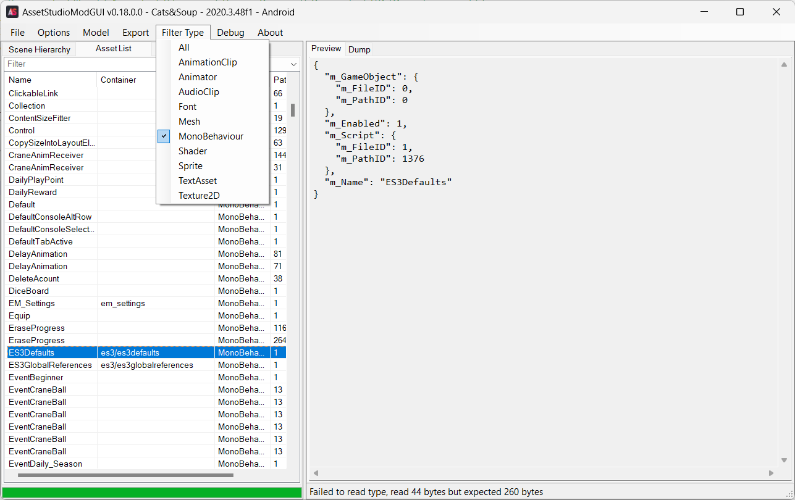

***disclaimer: nội dung trong bài viết này chỉ nhằm mục đích giáo dục, vui lòng không thực hiện hành vi gian lận game này. Bạn có thể bị khoá tài khoản nếu như bị nhà phát hành (HIDEA) phát hiện.***
# Mở đầu
Mình đã từng là một người "nghiện" [Cats & Soup](https://play.google.com/store/apps/details?id=com.hidea.cat) đến mức treo máy liên tục để cày sự kiện và có được những chú mèo phiên bản giới hạn. Sau nhiều tháng nghỉ chơi [Cats & Soup](https://play.google.com/store/apps/details?id=com.hidea.cat) và bỏ qua nhiều cơ hội "bắt" mèo VIP, mình quyết định quay lại game để xem sự thay đổi của game. Sau khi thấy những người chơi khác trên [r/CatsAndSoup](https://www.reddit.com/r/CatsAndSoup/) đã đạt đến số vàng 3 chữ cái, mình quyết định thử "đục" con game này để theo kịp tiến trình hiện tại của game.
<!--more-->
# Tổng quan
[Cats & Soup](https://play.google.com/store/apps/details?id=com.hidea.cat) là 1 con game sử dụng engine [Unity](https://unity.com/). Ta biết được điều đó thông qua các thư mục và các tệp asset trong `assets\bin\Data`. Ta sẽ không thấy các tệp dll như `Assembly-CSharp.dll` trong thư mục `Managed` vì game được biên dịch với scripting backend `IL2CPP`. Nếu bạn đã từng xem qua và nghiên cứu các game Unity IL2CPP, bạn có thể sẽ biết đến [Il2CppDumper](https://github.com/Perfare/Il2CppDumper) - một công cụ giúp reverse engineering IL2CPP. Tuy nhiên, nếu bạn thử kéo thả 2 tệp `global-metadata.dat` và `libil2cpp.so` vào `Il2CppDumper.exe`, bạn sẽ thấy lỗi như sau:


Có vẻ như tệp `global-metadata.dat` đã bị mã hoá. Nếu bạn mở tệp `global-metadata.dat` trong trình soạn thảo tệp nhị phân, bạn sẽ thấy cấu trúc tệp khác với tệp `global-metadata.dat` thông thường:


Như bạn có thể thấy, 4 magic byte đầu tiên (signature) của tệp `global-metadata.dat` đã bị thay đổi. Ngoài ra, nội dung của toàn bộ tệp `global-metadata.dat` cũng đã được mã hoá.

# LIAPP
nếu bạn xem qua nội dung tệp apk của game, bạn sẽ thấy một tệp `LIAPP.ini` có nội dung tương tự như sau:
```
[INFORMATION]
LIAgent=0
Job-Id#=*****
Version=v***** (0x*******) with Linux.
BuildNo=******

Contact=https://www.lockincomp.com/
This application is protected by LIAPP(Lockin Company's mobile security solution).
```
Vào trang web trong phần `Contact`, ta biết được LIAPP là một giải pháp bảo vệ ứng dụng mobile - Android và iOS - được sử dụng bởi không chỉ HIDEA mà còn bởi nhiều nhà phát triển game và ứng dụng khác. 


Tìm kiếm thêm về LIAPP, ta sẽ thấy khá nhiều thông tin liên quan tới LIAPP Alert:


Điều đó cho thấy LIAPP là một phương pháp bảo vệ khá mạnh và khó để vượt qua. Trên thực tế, nếu bạn sử dụng [Game Guardian](https://gameguardian.net/) (hay còn gọi là GG) để thay đổi giá trị vàng, kim cương, xu... của Cats & Soup, bạn sẽ thấy cảnh báo của LIAPP và game sẽ tự đóng sau vài giây:


Tuy nhiên, trong trường hợp của mình (sử dụng [WSA](https://github.com/MustardChef/WSABuilds) và [Bliss OS](https://blissos.org/)), GG có thể chạy và attach vào game mà không gặp vấn đề.

# Lấy file `global-metadata.dat` gốc của game
Để có thể sửa cấu trúc của tệp `global-metadata.dat`, một công ty hay cá nhân sẽ phải mua giấy phép một cách thủ công từ Unity. Có vẻ như LIAPP không làm điều đó. Nội dung của tệp `global-metadata.dat` được LIAPP giải mã và lưu trong bộ nhớ trước khi Unity khởi tạo và đọc nội dung tệp này. Do đó, ta có thể dễ dàng kết xuất tệp `global-metadata.dat` sử dụng bất cứ chương trình kết xuất bộ nhớ nào. Mình sẽ sử dụng [Game Guardian](https://gameguardian.net/) vì sự phổ biến, đơn giản và tiện lợi của nó.

Đầu tiên, ta sẽ khởi động GG và chọn Cats & Soup trong danh sách tiến trình:

<video controls>
	<source src="1.mp4" type="video/mp4"/>
</video>

Đừng quên chọn khoảng bộ nhớ như hình dưới:


Tiếp theo, ta sẽ tìm địa chỉ của 4 byte magic `AF 1B B1 FA` (địa chỉ bắt đầu của tệp `global-metadata.dat` trong bộ nhớ):

<video controls>
	<source src="2.mp4" type="video/mp4"/>
</video>

Sau đó, ta sẽ kết xuất bộ nhớ tại địa chỉ vừa tìm được:

<video controls>
	<source src="3.mp4" type="video/mp4"/>
</video>

tệp đã kết xuất sẽ nằm trong thư mục `storage/emulated/0/dump/` và có phần mở rộng là `.bin`. Sau khi sao chép tệp sang máy tính, ta sẽ xoá phần dữ liệu trước 4 byte magic `AF 1B B1 FA`:


Sau khi đổi tên tệp đã chỉnh sửa thành `global-metadata.dat`, bạn có thể sử dụng [Il2CppDumper](https://github.com/Perfare/Il2CppDumper) để tạo ra các tệp dll dummy.


# Save file
Mở tệp `Assembly-CSharp-firstpass.dll` bằng [dnSpy](https://github.com/dnSpyEx/dnSpy), ta sẽ thấy một số class và namespace bắt đầu bằng `ES3`, giống như phần mở rộng của tệp dữ liệu `SaveFile.es3` tại đường dẫn `/storage/emulated/0/Android/data/com.hidea.cat/files/`:


Google tên của một vài class sẽ cho thấy Cats & Soup sử dụng [Easy Save 3](https://assetstore.unity.com/packages/tools/utilities/easy-save-the-complete-save-data-serializer-system-768) để mã hoá và giải mã tệp `SaveFile.es3`. Để giải mã được, ta cần có mật khẩu dùng để mã hoá tệp. Nhưng làm thế nào để biết mật khẩu? Khá may, Easy Save 3 có thể tải xuống ở trên một số web chia sẻ Unity package lậu. Ta có thể đọc mã của Easy Save 3 để biết cách giải mã tệp. Sau khi có được package và sử dụng [unitypackage_extractor](https://github.com/Cobertos/unitypackage_extractor) để lấy nội dung của package, ta có được thư mục với cấu trúc như sau:

```
C:.
│   Easy Save - The Complete Save Data Serializer System 3.5.6.unitypackage
│   extractor.exe
│   unitypackage_extractor-x86.zip
│
└───Assets
    └───Plugins
        └───Easy Save 3
            ├───Change Log
            │       Change Log.txt
            │
            ├───Editor
            │       AddES3Prefab.cs
            │       AutoSaveWindow.cs
            │       checkmark.png
            │       checkmarkSmall.png
            │       EasySave3.asmdef.disabled
            │       EasySave3Editor.asmdef.disabled
            │       EnableES3AssemblyDefinitions.cs
            │       ES3Asmdefs.unitypackage
            │       ES3AutoSaveEditor.cs
            │       ES3AutoSaveMgrEditor.cs
            │       ES3ClassTypeTemplate.txt
            │       ES3ComponentTypeTemplate.txt
            │       ES3EditorStyle.cs
            │       ES3EditorUtility.cs
            │       ES3GameObjectEditor.cs
            │       ES3GlobalReferencesEditor.cs
            │       ES3InspectorInfoEditor.cs
            │       es3Logo16x16-bw.png
            │       es3Logo16x16.png
            │       ES3PlayMakerEditor.cs
            │       ES3Postprocessor.cs
            │       ES3PrefabEditor.cs
            │       ES3ReferenceMgrEditor.cs
            │       ES3ScriptableObjectTypeTemplate.txt
            │       ES3ScriptingDefineSymbols.cs
            │       ES3SettingsEditor.cs
            │       ES3TypeTemplate.txt
            │       ES3Type_MaterialTemplate.txt
            │       ES3ValueTypeTemplate.txt
            │       ES3Window.cs
            │       HomeWindow.cs
            │       ReferencesWindow.cs
            │       SettingsWindow.cs
            │       ToolsWindow.cs
            │       TypesWindow.cs
            │
            ├───PlayMaker
            │       ES3PlayMaker.cs
            │
            ├───Scripts
            │   │   ES3.cs
            │   │   ES3Crypto.cs
            │   │   ES3File.cs
            │   │   ES3GameObject.cs
            │   │   ES3InspectorInfo.cs
            │   │   ES3IO.cs
            │   │   ES3Prefab.cs
            │   │   ES3ReferenceMgr.cs
            │   │   ES3ReferenceMgrBase.cs
            │   │   ES3Reflection.cs
            │   │   ES3SerializableDictionary.cs
            │   │   ES3Spreadsheet.cs
            │   │
            │   ├───Attributes
            │   │       ES3Attributes.cs
            │   │
            │   ├───Auto Save
            │   │       ES3AutoSave.cs
            │   │       ES3AutoSaveMgr.cs
            │   │
            │   ├───Debugging
            │   │       ES3Debug.cs
            │   │
            │   ├───Readers
            │   │       ES3JSONReader.cs
            │   │       ES3Reader.cs
            │   │       ES3XMLReader.cs
            │   │
            │   ├───Referencing
            │   │       ES3GlobalReferences.cs
            │   │
            │   ├───Settings
            │   │       ES3Defaults.cs
            │   │       ES3DefaultSettings.cs
            │   │       ES3Settings.cs
            │   │
            │   ├───Streams
            │   │       ES3FileStream.cs
            │   │       ES3PlayerPrefsStream.cs
            │   │       ES3ResourcesStream.cs
            │   │       ES3Stream.cs
            │   │
            │   ├───Types
            │   │   │   ES3ComponentType.cs
            │   │   │   ES3ObjectType.cs
            │   │   │   ES3Property.cs
            │   │   │   ES3ScriptableObjectType.cs
            │   │   │   ES3Type.cs
            │   │   │   ES3TypeMgr.cs
            │   │   │   ES3UnityObjectType.cs
            │   │   │
            │   │   ├───Collection Types
            │   │   │       ES32DArrayType.cs
            │   │   │       ES33DArrayType.cs
            │   │   │       ES3ArrayType.cs
            │   │   │       ES3CollectionType.cs
            │   │   │       ES3ConcurrentDictionaryType.cs
            │   │   │       ES3DictionaryType.cs
            │   │   │       ES3HashSetType.cs
            │   │   │       ES3ListType.cs
            │   │   │       ES3NativeArrayType.cs
            │   │   │       ES3QueueType.cs
            │   │   │       ES3StackType.cs
            │   │   │       ES3TupleType.cs
            │   │   │
            │   │   ├───NET Types
            │   │   │       ES3Type_BigInteger.cs
            │   │   │       ES3Type_Random.cs
            │   │   │       ES3Type_Type.cs
            │   │   │
            │   │   ├───Primitive Types
            │   │   │       ES3Type_bool.cs
            │   │   │       ES3Type_byte.cs
            │   │   │       ES3Type_byteArray.cs
            │   │   │       ES3Type_char.cs
            │   │   │       ES3Type_DateTime.cs
            │   │   │       ES3Type_decimal.cs
            │   │   │       ES3Type_double.cs
            │   │   │       ES3Type_enum.cs
            │   │   │       ES3Type_ES3Ref.cs
            │   │   │       ES3Type_float.cs
            │   │   │       ES3Type_int.cs
            │   │   │       ES3Type_intptr.cs
            │   │   │       ES3Type_long.cs
            │   │   │       ES3Type_sbyte.cs
            │   │   │       ES3Type_short.cs
            │   │   │       ES3Type_string.cs
            │   │   │       ES3Type_uint.cs
            │   │   │       ES3Type_UIntPtr.cs
            │   │   │       ES3Type_ulong.cs
            │   │   │       ES3Type_ushort.cs
            │   │   │
            │   │   ├───Reflected Types
            │   │   │       ES3ReflectedComponentType.cs
            │   │   │       ES3ReflectedObjectType.cs
            │   │   │       ES3ReflectedScriptableObjectType.cs
            │   │   │       ES3ReflectedType.cs
            │   │   │       ES3ReflectedUnityObjectType.cs
            │   │   │       ES3ReflectedValueType.cs
            │   │   │
            │   │   └───Unity Types
            │   │       │   ES3Type_AnimationCurve.cs
            │   │       │   ES3Type_AudioClip.cs
            │   │       │   ES3Type_BoneWeight.cs
            │   │       │   ES3Type_Bounds.cs
            │   │       │   ES3Type_Burst.cs
            │   │       │   ES3Type_CollisionModule.cs
            │   │       │   ES3Type_Color.cs
            │   │       │   ES3Type_Color32.cs
            │   │       │   ES3Type_ColorBySpeedModule.cs
            │   │       │   ES3Type_ColorOverLifetimeModule.cs
            │   │       │   ES3Type_EmissionModule.cs
            │   │       │   ES3Type_ExternalForcesModule.cs
            │   │       │   ES3Type_Flare.cs
            │   │       │   ES3Type_Font.cs
            │   │       │   ES3Type_ForceOverLifetimeModule.cs
            │   │       │   ES3Type_GameObject.cs
            │   │       │   ES3Type_Gradient.cs
            │   │       │   ES3Type_GradientAlphaKey.cs
            │   │       │   ES3Type_GradientColorKey.cs
            │   │       │   ES3Type_Guid.cs
            │   │       │   ES3Type_InheritVelocityModule.cs
            │   │       │   ES3Type_Keyframe.cs
            │   │       │   ES3Type_LayerMask.cs
            │   │       │   ES3Type_Light.cs
            │   │       │   ES3Type_LightsModule.cs
            │   │       │   ES3Type_LimitVelocityOverLifetimeModule.cs
            │   │       │   ES3Type_MainModule.cs
            │   │       │   ES3Type_Material.cs
            │   │       │   ES3Type_Matrix4x4.cs
            │   │       │   ES3Type_Mesh.cs
            │   │       │   ES3Type_MinMaxCurve.cs
            │   │       │   ES3Type_MinMaxGradient.cs
            │   │       │   ES3Type_NoiseModule.cs
            │   │       │   ES3Type_PhysicMaterial.cs
            │   │       │   ES3Type_PhysicsMaterial2D.cs
            │   │       │   ES3Type_Quaternion.cs
            │   │       │   ES3Type_Rect.cs
            │   │       │   ES3Type_RectTransform.cs
            │   │       │   ES3Type_RenderTexture.cs
            │   │       │   ES3Type_RotationBySpeedModule.cs
            │   │       │   ES3Type_RotationOverLifetimeModule.cs
            │   │       │   ES3Type_Shader.cs
            │   │       │   ES3Type_ShapeModule.cs
            │   │       │   ES3Type_SizeBySpeedModule.cs
            │   │       │   ES3Type_SizeOverLifetimeModule.cs
            │   │       │   ES3Type_SkinnedMeshRenderer.cs
            │   │       │   ES3Type_Sprite.cs
            │   │       │   ES3Type_SpriteRenderer.cs
            │   │       │   ES3Type_SubEmittersModule.cs
            │   │       │   ES3Type_Texture.cs
            │   │       │   ES3Type_Texture2D.cs
            │   │       │   ES3Type_TextureSheetAnimationModule.cs
            │   │       │   ES3Type_TrailModule.cs
            │   │       │   ES3Type_TriggerModule.cs
            │   │       │   ES3Type_Vector2.cs
            │   │       │   ES3Type_Vector2Int.cs
            │   │       │   ES3Type_Vector3.cs
            │   │       │   ES3Type_Vector3Int.cs
            │   │       │   ES3Type_Vector4.cs
            │   │       │   ES3Type_VelocityOverLifetimeModule.cs
            │   │       │   UnityObjectType.cs
            │   │       │
            │   │       └───Component Types
            │   │               ES3Type_BoxCollider.cs
            │   │               ES3Type_BoxCollider2D.cs
            │   │               ES3Type_Camera.cs
            │   │               ES3Type_CapsuleCollider.cs
            │   │               ES3Type_EventSystem.cs
            │   │               ES3Type_Image.cs
            │   │               ES3Type_MeshCollider.cs
            │   │               ES3Type_MeshFilter.cs
            │   │               ES3Type_MeshRenderer.cs
            │   │               ES3Type_ParticleSystem.cs
            │   │               ES3Type_PolygonCollider2D.cs
            │   │               ES3Type_RawImage.cs
            │   │               ES3Type_Rigidbody.cs
            │   │               ES3Type_SphereCollider.cs
            │   │               ES3Type_Text.cs
            │   │               ES3Type_Transform.cs
            │   │
            │   ├───Web
            │   │       ES3Cloud.cs
            │   │       ES3WebClass.cs
            │   │
            │   └───Writers
            │           ES3Binary.cs
            │           ES3BinaryWriter.cs
            │           ES3CacheWriter.cs
            │           ES3JSONWriter.cs
            │           ES3Writer.cs
            │           ES3XMLWriter.cs
            │
            └───Web
                    ES3Cloud.php
```

Tìm kiếm một số từ liên quan đến mật khẩu như `password` sẽ dẫn tới biến `encryptionPassword` trong class `ES3Settings`:

```csharp
using ...
...
public class ES3Settings : System.ICloneable
{
    #region Default settings
	...
	    private const string defaultSettingsPath = "ES3/ES3Defaults";

		public static ES3Defaults defaultSettingsScriptableObject
		{
			get
			{
				if (_defaultSettingsScriptableObject == null)
				{
					_defaultSettingsScriptableObject = Resources.Load<ES3Defaults>(defaultSettingsPath);
#if UNITY_EDITOR
					...
#endif
				}
				return _defaultSettingsScriptableObject;
			}
		}
		
		public static ES3Settings defaultSettings
		{
			get
			{
				if(_defaults == null)
				{
					if(defaultSettingsScriptableObject != null)
						_defaults = defaultSettingsScriptableObject.settings;
				}
				return _defaults;
			}
		}
	...
    #endregion

	#region Fields
	...
	/// <summary>The path associated with this ES3Settings object, if any.</summary>
	public string path = "SaveFile.es3";
	...
	/// <summary>The password to use when encrypting data.</summary>
	public string encryptionPassword = "password";
	...
	#endregion
	...
}
```

Tìm tất cả tham chiếu đến biến `encryptionPassword` sẽ thấy biến này được truy cập qua property `defaultSettings`. Dựa vào nội dung class `ES3Settings`, ta thấy getter của `defaultSettings` trả về `defaultSettingsScriptableObject.settings`, `defaultSettingsScriptableObject` trả về `_defaultSettingsScriptableObject`, là một `ES3Defaults` được tải thông qua `Resources.Load` tại đường dẫn là giá trị của constant `defaultSettingsPath`. Tên save file của Cats & Soup vẫn để mặc định là `SaveFile.es3`, điều đó cho thấy Cats & Soup có thể sử dụng `defaultSettings` để mã hoá dữ liệu. Ta sẽ tạo một dự án Unity, import Easy Save 3 package và dùng đoạn mã sau để giải mã tệp `SaveFile.es3`:

```csharp
using System;
using System.IO;
using System.Text;
using UnityEngine;

public class ES3Decryptor : MonoBehaviour
{
    void Start()
    {
        string path = "SaveFile.es3";
        byte[] data = ES3.LoadRawBytes(path);
        byte[] decryptedData = ES3.DecryptBytes(data, "password");
        string str = Encoding.UTF8.GetString(decryptedData);
        File.WriteAllText("SaveFile.json", str);
    }
}
```

Chạy thử đoạn mã trên bằng cách vào play mode trong Unity Editor, ta gặp phải ngoại lệ: 

```
CryptographicException: Bad PKCS7 padding. Invalid length 0.
  at Mono.Security.Cryptography.SymmetricTransform.ThrowBadPaddingException (System.Security.Cryptography.PaddingMode padding, System.Int32 length, System.Int32 position) [0x00056] in <4b234520e36749be9cf6b053d911690f>:0 
  at Mono.Security.Cryptography.SymmetricTransform.FinalDecrypt (System.Byte[] inputBuffer, System.Int32 inputOffset, System.Int32 inputCount) [0x00146] in <4b234520e36749be9cf6b053d911690f>:0 
  at Mono.Security.Cryptography.SymmetricTransform.TransformFinalBlock (System.Byte[] inputBuffer, System.Int32 inputOffset, System.Int32 inputCount) [0x0002e] in <4b234520e36749be9cf6b053d911690f>:0 
  at System.Security.Cryptography.CryptoStream.FlushFinalBlock () [0x00013] in <4b234520e36749be9cf6b053d911690f>:0 
  at System.Security.Cryptography.CryptoStream.Dispose (System.Boolean disposing) [0x0000b] in <4b234520e36749be9cf6b053d911690f>:0 
  at System.IO.Stream.Close () [0x00000] in <4b234520e36749be9cf6b053d911690f>:0 
  at System.IO.Stream.Dispose () [0x00000] in <4b234520e36749be9cf6b053d911690f>:0 
  at ES3Internal.AESEncryptionAlgorithm.Decrypt (System.IO.Stream input, System.IO.Stream output, System.String password, System.Int32 bufferSize) [0x0005f] in G:\Unity Projects\Test\Assets\Plugins\Easy Save 3\Scripts\ES3Crypto.cs:165 
  at ES3Internal.AESEncryptionAlgorithm.Decrypt (System.Byte[] bytes, System.String password, System.Int32 bufferSize) [0x00010] in G:\Unity Projects\Test\Assets\Plugins\Easy Save 3\Scripts\ES3Crypto.cs:69 
  at ES3.DecryptBytes (System.Byte[] bytes, System.String password) [0x00017] in G:\Unity Projects\Test\Assets\Plugins\Easy Save 3\Scripts\ES3.cs:915 
  at ES3Decryptor.Start () [0x00013] in G:\Unity Projects\Test\Assets\Script\ES3Decryptor.cs:12
```

HIDEA đã thay đổi mật khẩu mặc định dùng để mã hoá tệp `SaveFile.es3` (chẳng ai kém thông minh mà đặt mật khẩu là `password` cả). Vì mật khẩu được tải từ đường dẫn `ES3/ES3Defaults`, ta có thể lấy mật khẩu bằng cách extract asset của game. Giải nén thư mục `assets` từ tệp apk của game, kéo thả vào [AssetStudioMod](https://github.com/aelurum/AssetStudio) và lọc `MonoBehaviour`, ta sẽ thấy asset `ES3Defaults` với container path là `ES3/ES3Defaults`:



Tuy nhiên, không có mật khẩu nào trong asset này. Ta sẽ thử xuất raw asset này bằng cách chọn asset `ES3Defaults`, sau đó chọn `Export` -> `Raw` -> `Selected assets`:


Lần này, mật khẩu đã hiện rõ trong tệp `ES3Defaults.dat` vừa mới xuất:

 

Thay `#hidea0417` vào đoạn mã giải mã ở trên và chạy thử, ta được tệp `SaveFile.json`:

 

Bây giờ ta có thể chỉnh sửa save file tuỳ thích. Lưu ý không dùng trình định dạng JSON vì một số trường trong save file có kiểu `Dictionary<int, int>` và sẽ bị các trình định dạng JSON hiểu là string.


***Lưu ý**: nếu bạn sửa các giá trị của `gold` (vàng), `energy` (năng lượng), `gem` (kim cương), khi game khởi động sẽ gửi báo cáo gian lận lên server và sẽ khiến tài khoản của bạn bị khoá.*

Sau khi chỉnh sửa xong, ta sẽ dùng đoạn mã sau để mã hoá tệp `SaveFile.json` thành tệp `SaveFile.es3` mới:

```csharp
string jsonPath = "SaveFile.json";
string jsonContent = File.ReadAllText(jsonPath);
byte[] encryptedData = ES3.EncryptBytes(Encoding.UTF8.GetBytes(jsonContent), "#hidea0417");
File.WriteAllBytes("SaveFile-new.es3", encryptedData);
```

Thay thế tệp `SaveFile.es3` gốc thành tệp mới và tận hưởng!

<video controls>
	<source src="4.mp4" type="video/mp4"/>
</video>

# Kết luận
Một lần nữa, bài viết này chỉ nhằm mục đích giáo dục. Bạn tự chịu trách nhiệm nếu như tài khoản của bạn bị khoá do làm theo hướng dẫn trong bài viết này. Nếu bạn có thắc mắc cần giải đáp, bạn có thể để lại bình luận phía dưới hoặc tham gia [server Discord](https://discord.gg/ekMDKCa5jQ) của mình.